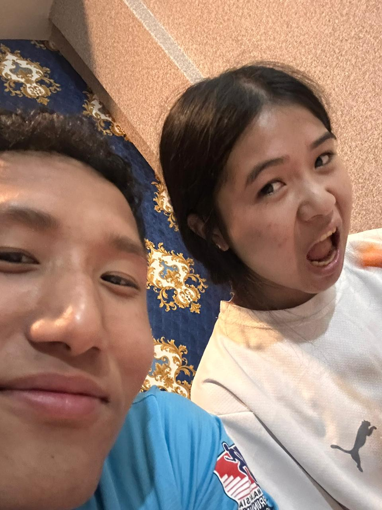
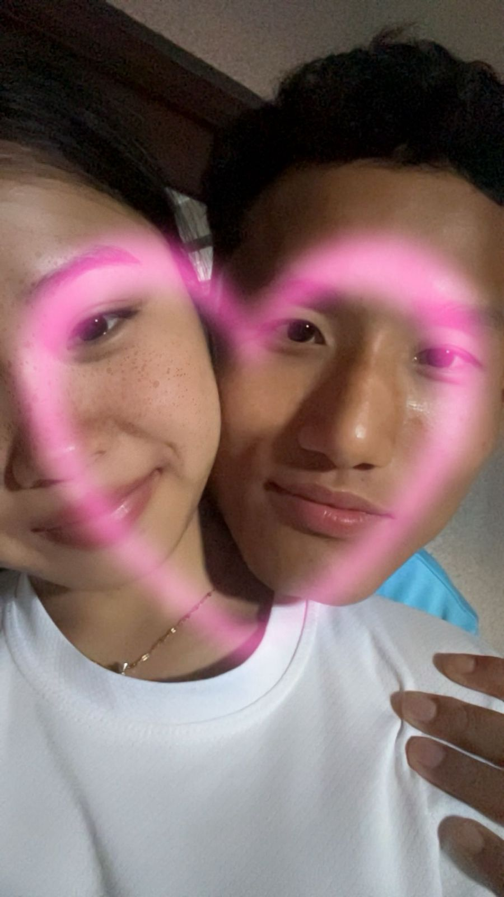
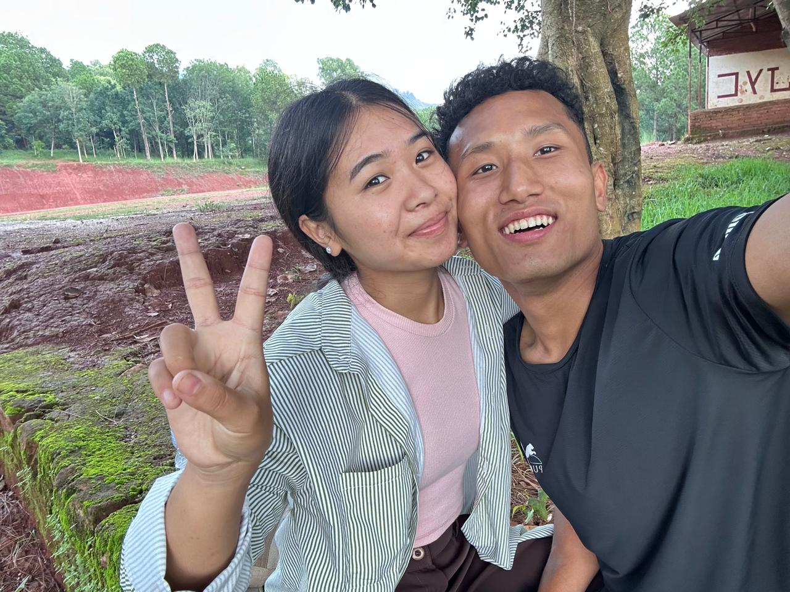
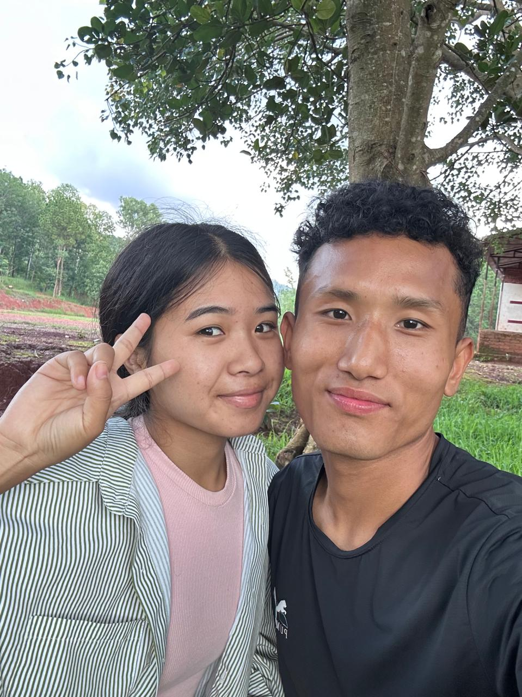
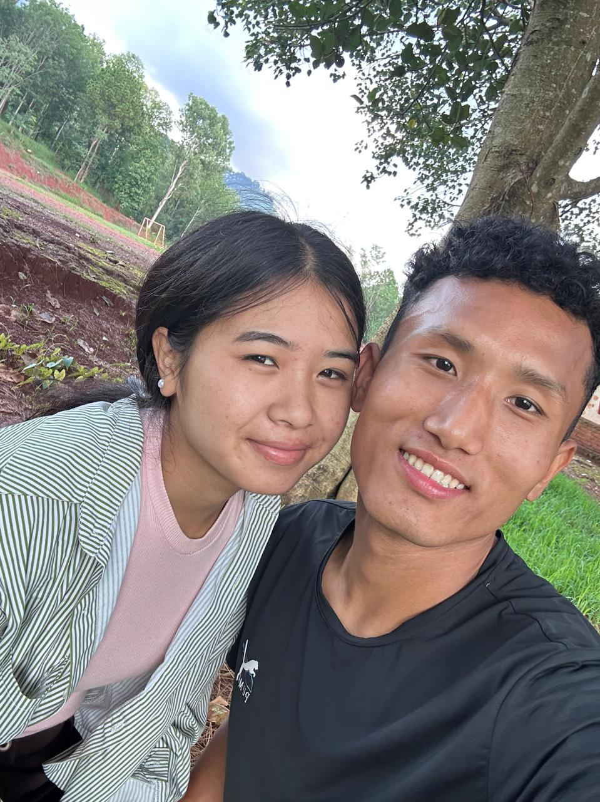
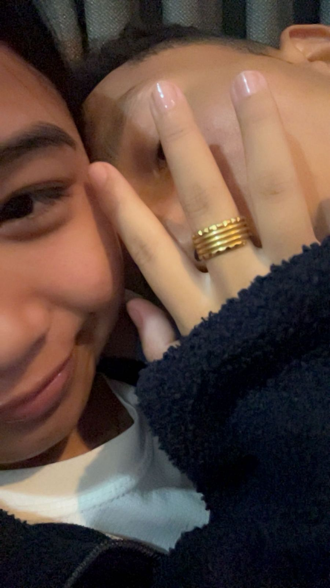

<!DOCTYPE html>
<html>
<head>
<title>My Princess Sandhya ❤️</title>

</head>

<body>

❤️

<h1>For My Princess Sandhya 💖</h1>

A little surprise from Roshan

<button onclick="openPage()">Open My Heart 💌</button>

<h1>My cutiee Sandhya 💖</h1>

❤️

<h2>A message for you 🌹</h2>

Babyy💗 I made this little world just for you.
  
No matter how far we are, you are always close to my heart.
Thank you for bringing happiness into my life.

<h2>Our Memories 📸❤️</h2>

Every picture carries a memory I treasure ❤️

<h2>Why I Love You ❤️</h2>

Your smile ❤️  
Your kindness 🥰  
Your beautiful heart 💖  
The way you make ordinary moments special 💝  
The memories we create together 💘  
Simply because you are Sandhya ❤️

<h2>Secret Message 💌</h2>

<button onclick="secret()">Tap Here ❤️</button>

My dearest budi Sandhya🫶🏻🙆🏻💕
  
Whenever you doubt yourself, remember that there is someone who feels lucky to have you.
I love you in every universe ❤️♾️

<h2>My Promise 💖</h2>

Baby🥺💐💗
  
I will always try to make you feel loved, respected, and special.
Distance may separate us physically, but my heart is always with you.
  
Forever yours,
 
Roshan ❤️

</body>
</html>
